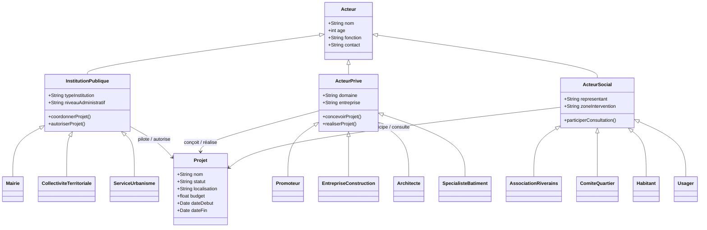

```mermaid
classDiagram
    direction TB

    %% Classe de base
    class Acteur {
        +String nom
        +int age
        +String fonction
        +String contact
    }

    %% Typologies d’acteurs
    class InstitutionPublique {
        +String typeInstitution
        +String niveauAdministratif
        +coordonnerProjet()
        +autoriserProjet()
    }

    class ActeurPrive {
        +String domaine
        +String entreprise
        +concevoirProjet()
        +realiserProjet()
    }

    class ActeurSocial {
        +String representant
        +String zoneIntervention
        +participerConsultation()
    }

    %% Institutions publiques
    class Mairie
    class CollectiviteTerritoriale
    class ServiceUrbanisme

    %% Acteurs privés
    class Promoteur
    class EntrepriseConstruction
    class Architecte
    class SpecialisteBatiment

    %% Acteurs sociaux
    class AssociationRiverains
    class ComiteQuartier
    class Habitant
    class Usager

    %% Projet (objet central en bas)
    class Projet {
        +String nom
        +String statut
        +String localisation
        +float budget
        +Date dateDebut
        +Date dateFin
    }

    %% Héritage
    Acteur <|-- InstitutionPublique
    Acteur <|-- ActeurPrive
    Acteur <|-- ActeurSocial

    InstitutionPublique <|-- Mairie
    InstitutionPublique <|-- CollectiviteTerritoriale
    InstitutionPublique <|-- ServiceUrbanisme

    ActeurPrive <|-- Promoteur
    ActeurPrive <|-- EntrepriseConstruction
    ActeurPrive <|-- Architecte
    ActeurPrive <|-- SpecialisteBatiment

    ActeurSocial <|-- AssociationRiverains
    ActeurSocial <|-- ComiteQuartier
    ActeurSocial <|-- Habitant
    ActeurSocial <|-- Usager

    %% Relations fonctionnelles vers le Projet
    InstitutionPublique --> Projet : pilote / autorise
    ActeurPrive --> Projet : conçoit / réalise
    ActeurSocial --> Projet : participe / consulte

```

