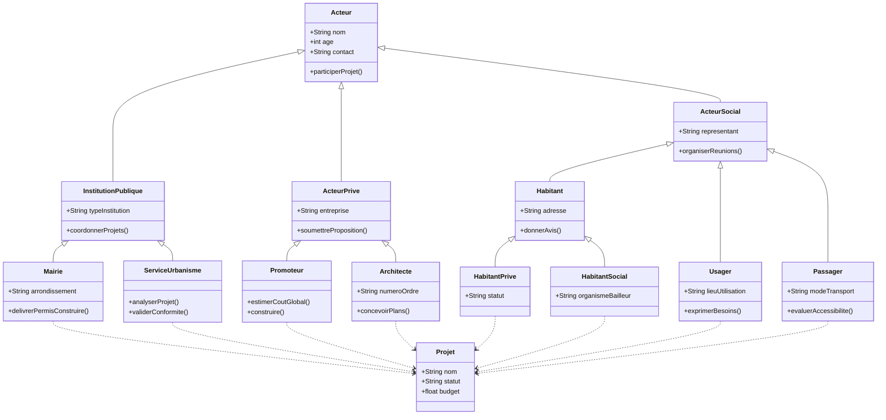

```mermaid
classDiagram
    direction TB

    class Acteur {
        +String nom
        +int age
        +String contact
        +participerProjet()
    }

    class InstitutionPublique {
        +String typeInstitution
        +coordonnerProjets()
    }

    class ActeurPrive {
        +String entreprise
        +soumettreProposition()
    }

    class ActeurSocial {
        +String representant
        +organiserReunions()
    }

    class Mairie {
        +String arrondissement
        +delivrerPermisConstruire()
    }

    class ServiceUrbanisme {
        +analyserProjet()
        +validerConformite()
    }

    class Promoteur {
        +estimerCoutGlobal()
        +construire()
    }

    class Architecte {
        +String numeroOrdre
        +concevoirPlans()
    }

    class Habitant {
        +String adresse
        +donnerAvis()
    }

    class HabitantPrive {
        +String statut
    }

    class HabitantSocial {
        +String organismeBailleur
    }

    class Usager {
        +String lieuUtilisation
        +exprimerBesoins()
    }

    class Passager {
        +String modeTransport
        +evaluerAccessibilite()
    }

    class Projet {
        +String nom
        +String statut
        +float budget
    }

    %% Hiérarchie
    Acteur <|-- InstitutionPublique
    Acteur <|-- ActeurPrive
    Acteur <|-- ActeurSocial

    InstitutionPublique <|-- Mairie
    InstitutionPublique <|-- ServiceUrbanisme
    ActeurPrive <|-- Promoteur
    ActeurPrive <|-- Architecte

    ActeurSocial <|-- Habitant
    ActeurSocial <|-- Usager
    ActeurSocial <|-- Passager
    Habitant <|-- HabitantPrive
    Habitant <|-- HabitantSocial

    %% Flux vers le bas
    Mairie ..> Projet
    ServiceUrbanisme ..> Projet
    Promoteur ..> Projet
    Architecte ..> Projet
    HabitantPrive ..> Projet
    HabitantSocial ..> Projet
    Usager ..> Projet
    Passager ..> Projet
```
