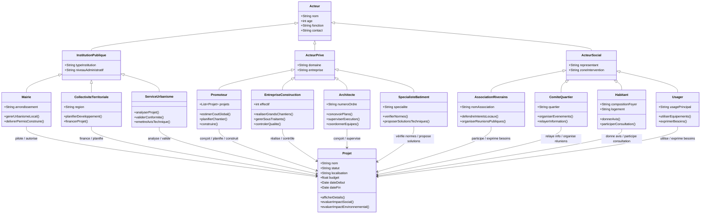

```mermaid
classDiagram
    direction TB

    %% Classe de base
    class Acteur {
        +String nom
        +int age
        +String fonction
        +String contact
    }

    %% Sous-classes principales
    class InstitutionPublique {
        +String typeInstitution
        +String niveauAdministratif
    }

    class ActeurPrive {
        +String domaine
        +String entreprise
    }

    class ActeurSocial {
        +String representant
        +String zoneIntervention
    }

    %% Institutions publiques
    class Mairie {
        +String arrondissement
        +gererUrbanismeLocal()
        +delivrerPermisConstruire()
    }

    class CollectiviteTerritoriale {
        +String region
        +planifierDeveloppement()
        +financerProjet()
    }

    class ServiceUrbanisme {
        +analyserProjet()
        +validerConformite()
        +emettreAvisTechnique()
    }

    %% Acteurs privés
    class Promoteur {
        +List~Projet~ projets
        +estimerCoutGlobal()
        +planifierChantier()
        +construire()
    }

    class EntrepriseConstruction {
        +int effectif
        +realiserGrandsChantiers()
        +gererSousTraitants()
        +controlerQualite()
    }

    class Architecte {
        +String numeroOrdre
        +concevoirPlans()
        +superviserExecution()
        +coordonnerEquipes()
    }

    class SpecialisteBatiment {
        +String specialite
        +verifierNormes()
        +proposerSolutionsTechniques()
    }

    %% Acteurs sociaux
    class AssociationRiverains {
        +String nomAssociation
        +defendreInteretsLocaux()
        +organiserReunionsPubliques()
    }

    class ComiteQuartier {
        +String quartier
        +organiserEvenements()
        +relayerInformation()
    }

    class Habitant {
        +String compositionFoyer
        +String logement
        +donnerAvis()
        +participerConsultation()
    }

    class Usager {
        +String usagePrincipal
        +utiliserEquipements()
        +exprimerBesoins()
    }

    %% Projet (objet central)
    class Projet {
        +String nom
        +String statut
        +String localisation
        +float budget
        +Date dateDebut
        +Date dateFin
        +afficherDetails()
        +evaluerImpactSocial()
        +evaluerImpactEnvironnemental()
    }

    %% Héritage
    Acteur <|-- InstitutionPublique
    Acteur <|-- ActeurPrive
    Acteur <|-- ActeurSocial

    InstitutionPublique <|-- Mairie
    InstitutionPublique <|-- CollectiviteTerritoriale
    InstitutionPublique <|-- ServiceUrbanisme

    ActeurPrive <|-- Promoteur
    ActeurPrive <|-- EntrepriseConstruction
    ActeurPrive <|-- Architecte
    ActeurPrive <|-- SpecialisteBatiment

    ActeurSocial <|-- AssociationRiverains
    ActeurSocial <|-- ComiteQuartier
    ActeurSocial <|-- Habitant
    ActeurSocial <|-- Usager

    %% Relations explicites vers Projet
    Mairie --> Projet : pilote / autorise
    CollectiviteTerritoriale --> Projet : finance / planifie
    ServiceUrbanisme --> Projet : analyse / valide

    Promoteur --> Projet : conçoit / planifie / construit
    EntrepriseConstruction --> Projet : réalise / contrôle
    Architecte --> Projet : conçoit / supervise
    SpecialisteBatiment --> Projet : vérifie normes / propose solutions

    AssociationRiverains --> Projet : participe / exprime besoins
    ComiteQuartier --> Projet : relaye info / organise réunions
    Habitant --> Projet : donne avis / participe consultation
    Usager --> Projet : utilise / exprime besoins


```
