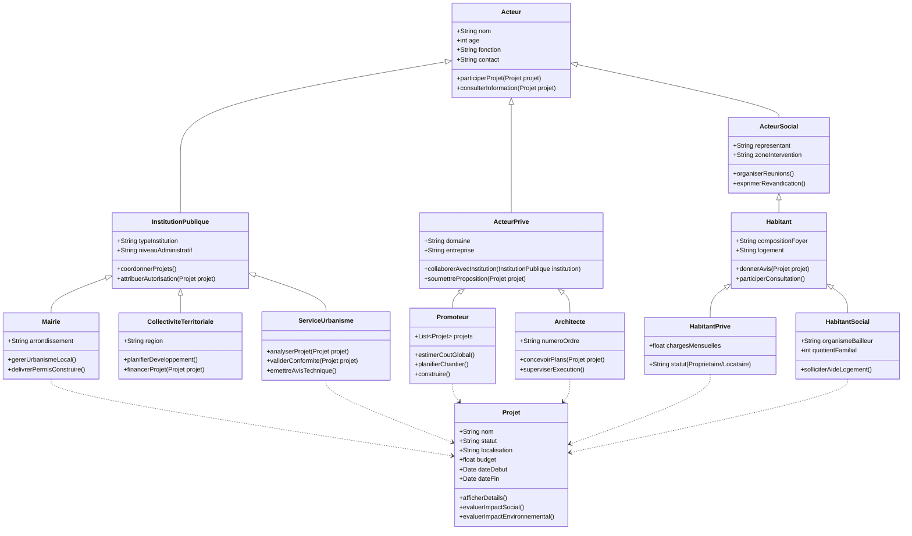

```mermaid
classDiagram
    direction TB

    %% --- NIVEAU 1 : LA RACINE ---
    class Acteur {
        +String nom
        +int age
        +String fonction
        +String contact
        +participerProjet(Projet projet)
        +consulterInformation(Projet projet)
    }

    %% --- NIVEAU 2 : LES FAMILLES ---
    class InstitutionPublique {
        +String typeInstitution
        +String niveauAdministratif
        +coordonnerProjets()
        +attribuerAutorisation(Projet projet)
    }

    class ActeurPrive {
        +String domaine
        +String entreprise
        +collaborerAvecInstitution(InstitutionPublique institution)
        +soumettreProposition(Projet projet)
    }

    class ActeurSocial {
        +String representant
        +String zoneIntervention
        +organiserReunions()
        +exprimerRevandication()
    }

    %% --- NIVEAU 3 : LES SPÉCIALISTES ---
    
    %% Public
    class Mairie {
        +String arrondissement
        +gererUrbanismeLocal()
        +delivrerPermisConstruire()
    }
    class CollectiviteTerritoriale {
        +String region
        +planifierDeveloppement()
        +financerProjet(Projet projet)
    }
    class ServiceUrbanisme {
        +analyserProjet(Projet projet)
        +validerConformite(Projet projet)
        +emettreAvisTechnique()
    }

    %% Privé
    class Promoteur {
        +List~Projet~ projets
        +estimerCoutGlobal()
        +planifierChantier()
        +construire()
    }
    class Architecte {
        +String numeroOrdre
        +concevoirPlans(Projet projet)
        +superviserExecution()
    }

    %% Social & Habitants
    class Habitant {
        +String compositionFoyer
        +String logement
        +donnerAvis(Projet projet)
        +participerConsultation()
    }
    class HabitantPrive {
        +String statut (Proprietaire/Locataire)
        +float chargesMensuelles
    }
    class HabitantSocial {
        +String organismeBailleur
        +int quotientFamilial
        +solliciterAideLogement()
    }

    %% --- NIVEAU 4 : LE PROJET (RÉSULTAT) ---
    class Projet {
        +String nom
        +String statut
        +String localisation
        +float budget
        +Date dateDebut
        +Date dateFin
        +afficherDetails()
        +evaluerImpactSocial()
        +evaluerImpactEnvironnemental()
    }

    %% --- RELATIONS D'HÉRITAGE ---
    Acteur <|-- InstitutionPublique
    Acteur <|-- ActeurPrive
    Acteur <|-- ActeurSocial

    InstitutionPublique <|-- Mairie
    InstitutionPublique <|-- CollectiviteTerritoriale
    InstitutionPublique <|-- ServiceUrbanisme

    ActeurPrive <|-- Promoteur
    ActeurPrive <|-- Architecte

    ActeurSocial <|-- Habitant
    Habitant <|-- HabitantPrive
    Habitant <|-- HabitantSocial

    %% --- RELATIONS DE FLUX (VERS LE BAS, SANS TEXTE) ---
    Mairie ..> Projet
    ServiceUrbanisme ..> Projet
    Promoteur ..> Projet
    Architecte ..> Projet
    HabitantPrive ..> Projet
    HabitantSocial ..> Projet
```
