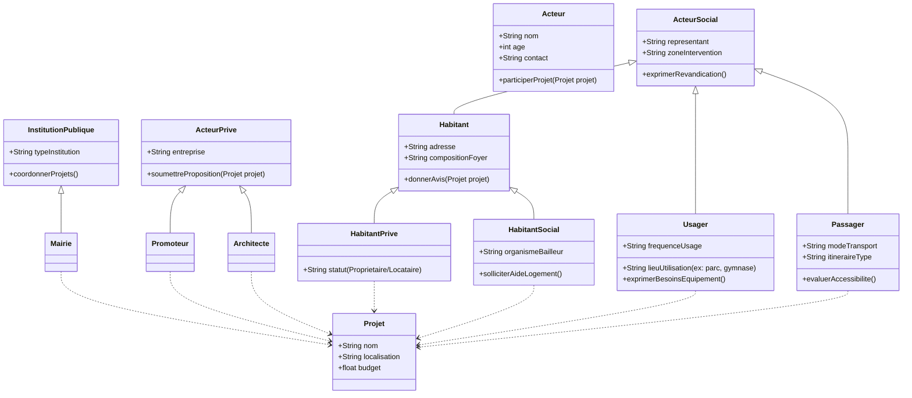

```mermaid
classDiagram
    direction TB

    %% --- NIVEAU 1 : LA RACINE ---
    class Acteur {
        +String nom
        +int age
        +String contact
        +participerProjet(Projet projet)
    }

    %% --- NIVEAU 2 : LES FAMILLES ---
    class InstitutionPublique {
        +String typeInstitution
        +coordonnerProjets()
    }

    class ActeurPrive {
        +String entreprise
        +soumettreProposition(Projet projet)
    }

    class ActeurSocial {
        +String representant
        +String zoneIntervention
        +exprimerRevandication()
    }

    %% --- NIVEAU 3 : SPÉCIALISATION SOCIALE (DÉTAILLÉE) ---
    ActeurSocial <|-- Habitant
    ActeurSocial <|-- Usager
    ActeurSocial <|-- Passager

    class Habitant {
        +String adresse
        +String compositionFoyer
        +donnerAvis(Projet projet)
    }

    class Usager {
        +String lieuUtilisation (ex: parc, gymnase)
        +String frequenceUsage
        +exprimerBesoinsEquipement()
    }

    class Passager {
        +String modeTransport
        +String itineraireType
        +evaluerAccessibilite()
    }

    %% --- NIVEAU 3 BIS : HABITANTS DÉTAILLÉS ---
    Habitant <|-- HabitantPrive
    Habitant <|-- HabitantSocial

    class HabitantPrive {
        +String statut (Proprietaire/Locataire)
    }

    class HabitantSocial {
        +String organismeBailleur
        +solliciterAideLogement()
    }

    %% --- NIVEAU 3 TER : AUTRES ACTEURS ---
    InstitutionPublique <|-- Mairie
    ActeurPrive <|-- Promoteur
    ActeurPrive <|-- Architecte

    %% --- NIVEAU 4 : LE PROJET ---
    class Projet {
        +String nom
        +String localisation
        +float budget
    }

    %% --- RELATIONS DE FLUX ---
    Mairie ..> Projet
    Promoteur ..> Projet
    Architecte ..> Projet
    HabitantPrive ..> Projet
    HabitantSocial ..> Projet
    Usager ..> Projet
    Passager ..> Projet
```
