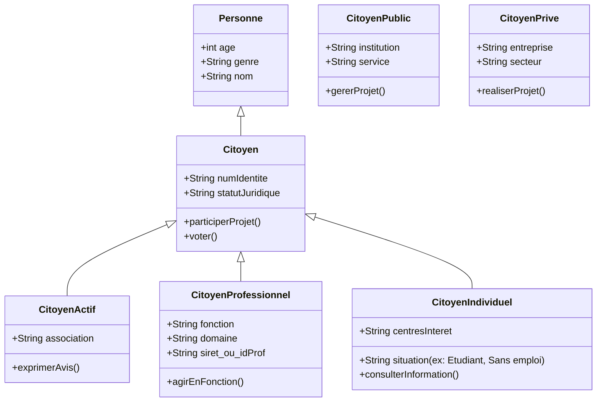

```mermaid
classDiagram
    Personne <|-- Citoyen
    Citoyen <|-- CitoyenActif
    Citoyen <|-- CitoyenProfessionnel
    Citoyen <|-- CitoyenIndividuel

  class Personne {
      +int age
      +String genre
      +String nom
  }

  class Citoyen {
       +String numIdentite
      +String statutJuridique
      +participerProjet()
      +voter()
  }

  class CitoyenIndividuel {
      +String situation (ex: Etudiant, Sans emploi)
      +String centresInteret
      +consulterInformation()
  }

  class CitoyenActif {
      +String association
      +exprimerAvis()
  }

  class CitoyenProfessionnel {
      +String fonction
      +String domaine
      +String siret_ou_idProf
      +agirEnFonction()
  }

  class CitoyenPublic {
      +String institution
      +String service
      +gererProjet()
  }

  class CitoyenPrive {
      +String entreprise
      +String secteur
      +realiserProjet()
  }
  
```
