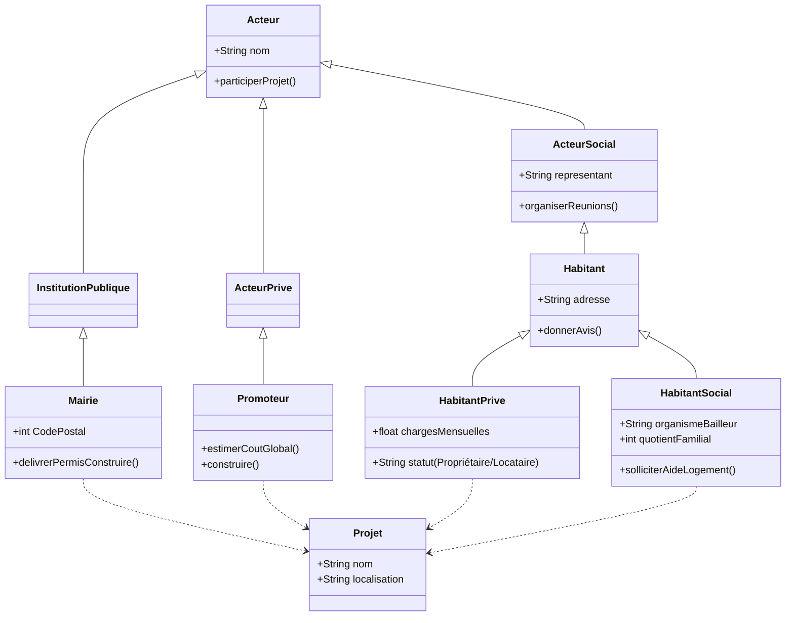

```mermaid
classDiagram
    direction TB

    %% --- BLOC ACTEURS ---
    class Acteur {
        +String nom
        +participerProjet()
    }

    class ActeurSocial {
        +String representant
        +organiserReunions()
    }

    %% --- SPÉCIALISATION HABITANT ---
    class Habitant {
        +String adresse
        +donnerAvis()
    }

    class HabitantPrive {
        +String statut (Propriétaire/Locataire)
        +float chargesMensuelles
    }

    class HabitantSocial {
        +String organismeBailleur
        +int quotientFamilial
        +solliciterAideLogement()
    }

    %% --- AUTRES ACTEURS (Compact) ---
    class Mairie {
        +int CodePostal
        +delivrerPermisConstruire()
    }

    class Promoteur {
        +estimerCoutGlobal()
        +construire()
    }

    %% --- RÉSULTAT ---
    class Projet {
        +String nom
        +String localisation
    }

    %% --- RELATIONS ---
    Acteur <|-- ActeurSocial
    ActeurSocial <|-- Habitant
    
    %% Distinction demandée
    Habitant <|-- HabitantPrive
    Habitant <|-- HabitantSocial

    %% Autres branches
    Acteur <|-- InstitutionPublique
    InstitutionPublique <|-- Mairie
    Acteur <|-- ActeurPrive
    ActeurPrive <|-- Promoteur

    %% Flux vers le Projet
    Mairie ..> Projet 
    Promoteur ..> Projet 
    HabitantPrive ..> Projet
    HabitantSocial ..> Projet
```
