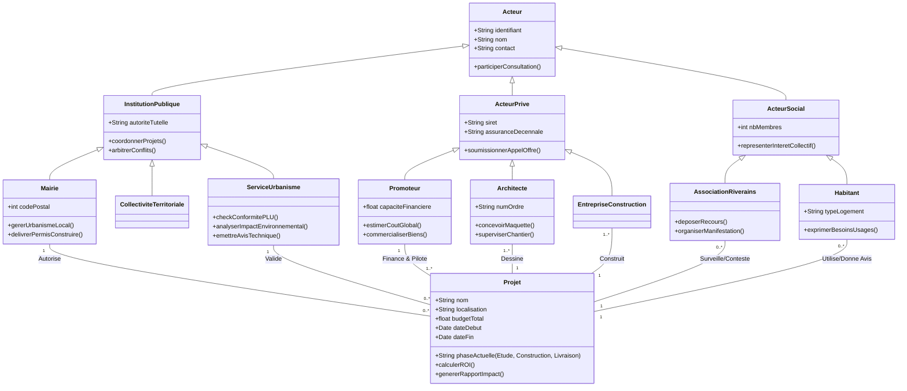

```mermaid
classDiagram
    %% Niveau 1 : Racines
    class Acteur {
        +String identifiant
        +String nom
        +String contact
        +participerConsultation()
    }

    %% Niveau 2 : Grandes Familles (Abstraites)
    Acteur <|-- InstitutionPublique
    Acteur <|-- ActeurPrive
    Acteur <|-- ActeurSocial

    class InstitutionPublique {
        +String autoriteTutelle
        +coordonnerProjets()
        +arbitrerConflits()
    }

    class ActeurPrive {
        +String siret
        +String assuranceDecennale
        +soumissionnerAppelOffre()
    }

    class ActeurSocial {
        +int nbMembres
        +representerInteretCollectif()
    }

    %% Niveau 3 : Spécialisations
    InstitutionPublique <|-- Mairie
    InstitutionPublique <|-- CollectiviteTerritoriale
    InstitutionPublique <|-- ServiceUrbanisme

    class Mairie {
        +int codePostal
        +gererUrbanismeLocal()
        +delivrerPermisConstruire()
    }

    class ServiceUrbanisme {
        +checkConformitePLU()
        +analyserImpactEnvironnemental()
        +emettreAvisTechnique()
    }

    ActeurPrive <|-- Promoteur
    ActeurPrive <|-- EntrepriseConstruction
    ActeurPrive <|-- Architecte

    class Promoteur {
        +float capaciteFinanciere
        +estimerCoutGlobal()
        +commercialiserBiens()
    }

    class Architecte {
        +String numOrdre
        +concevoirMaquette()
        +superviserChantier()
    }

    ActeurSocial <|-- AssociationRiverains
    ActeurSocial <|-- Habitant

    class AssociationRiverains {
        +deposerRecours()
        +organiserManifestation()
    }

    class Habitant {
        +String typeLogement
        +exprimerBesoinsUsages()
    }

    %% Niveau 4 : Le Projet (Cible de toutes les actions)
    class Projet {
        +String nom
        +String localisation
        +String phaseActuelle (Etude, Construction, Livraison)
        +float budgetTotal
        +Date dateDebut
        +Date dateFin
        +calculerROI()
        +genererRapportImpact()
    }

    %% Relations de dépendance (Acteurs -> Projet)
    Mairie "1" -- "0..*" Projet : Autorise
    ServiceUrbanisme "1" -- "0..*" Projet : Valide
    Promoteur "1" -- "1..*" Projet : Finance & Pilote
    Architecte "1..*" -- "1" Projet : Dessine
    EntrepriseConstruction "1..*" -- "1" Projet : Construit
    AssociationRiverains "0..*" -- "1" Projet : Surveille/Conteste
    Habitant "0..*" -- "1" Projet : Utilise/Donne Avis
```
