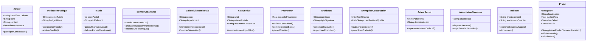

```mermaid
classDiagram
    %% --- BLOC HUMAIN / RACINE ---
    class Acteur {
        +String identifiant Unique
        +String nom
        +String contact
        +Date dateNaissance
        +participerConsultation()
    }

    %% --- BLOC INSTITUTIONS PUBLIQUES ---
    class InstitutionPublique {
        +String autoriteTutelle
        +String budgetAlloue
        +coordonnerProjets()
        +arbitrerConflits()
    }

    class Mairie {
        +int codePostal
        +String eluReferent
        +gererUrbanismeLocal()
        +delivrerPermisConstruire()
    }

    class ServiceUrbanisme {
        +checkConformitePLU()
        +analyserImpactEnvironnemental()
        +emettreAvisTechnique()
    }

    class CollectiviteTerritoriale {
        +String region
        +String departement
        +planifierDeveloppement()
        +financerSubvention()
    }

    %% --- BLOC ACTEURS PRIVÉS ---
    class ActeurPrive {
        +String siret
        +String raisonSociale
        +String assuranceDecennale
        +soumissionnerAppelOffre()
    }

    class Promoteur {
        +float capaciteFinanciere
        +estimerCoutGlobal()
        +commercialiserBiens()
        +piloterChantier()
    }

    class Architecte {
        +String numOrdre
        +String styleSignature
        +concevoirMaquette()
        +superviserExecution()
    }

    class EntrepriseConstruction {
        +int effectifOuvrier
        +List~String~ certificationsQualite
        +realiserGrosOeuvre()
        +gererSousTraitants()
    }

    %% --- BLOC ACTEURS SOCIAUX ---
    class ActeurSocial {
        +int nbAdherents
        +String domaineAction
        +representerInteretCollectif()
    }

    class AssociationRiverains {
        +String objetSocial
        +deposerRecours()
        +organiserManifestation()
    }

    class Habitant {
        +String typeLogement
        +String ancienneteQuartier
        +exprimerBesoinsUsages()
        +donnerAvis()
    }

    %% --- BLOC RÉSULTAT ---
    class Projet {
        +String nom
        +String localisation
        +String phase (Etude, Travaux, Livraison)
        +float budgetTotal
        +Date dateDebut
        +Date dateFin
        +afficherDetails()
        +calculerROI()
    }
```
