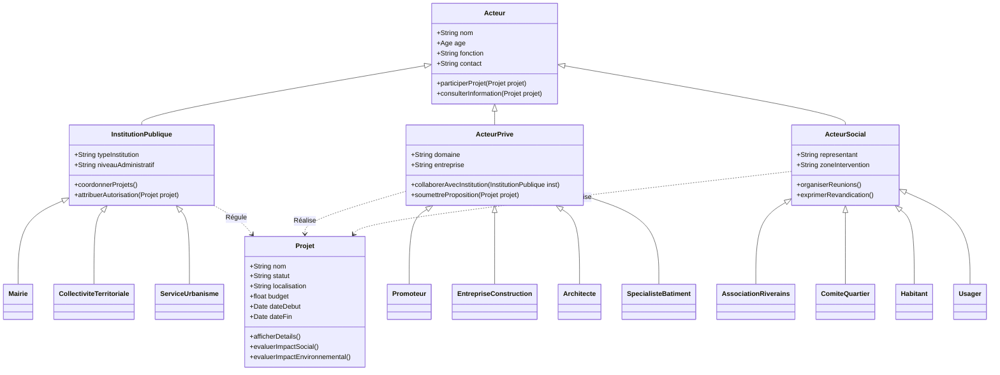

```mermaid
classDiagram
    %% Niveau 1 : La Base
    class Acteur {
        +String nom
        +Age age
        +String fonction
        +String contact
        +participerProjet(Projet projet)
        +consulterInformation(Projet projet)
    }

    %% Niveau 2 : Les Grandes Familles d'Acteurs
    Acteur <|-- InstitutionPublique
    Acteur <|-- ActeurPrive
    Acteur <|-- ActeurSocial

    class InstitutionPublique {
        +String typeInstitution
        +String niveauAdministratif
        +coordonnerProjets()
        +attribuerAutorisation(Projet projet)
    }

    class ActeurPrive {
        +String domaine
        +String entreprise
        +collaborerAvecInstitution(InstitutionPublique inst)
        +soumettreProposition(Projet projet)
    }

    class ActeurSocial {
        +String representant
        +String zoneIntervention
        +organiserReunions()
        +exprimerRevandication()
    }

    %% Niveau 3 : Spécialisations (Public / Privé / Social)
    InstitutionPublique <|-- Mairie
    InstitutionPublique <|-- CollectiviteTerritoriale
    InstitutionPublique <|-- ServiceUrbanisme

    ActeurPrive <|-- Promoteur
    ActeurPrive <|-- EntrepriseConstruction
    ActeurPrive <|-- Architecte
    ActeurPrive <|-- SpecialisteBatiment

    ActeurSocial <|-- AssociationRiverains
    ActeurSocial <|-- ComiteQuartier
    ActeurSocial <|-- Habitant
    ActeurSocial <|-- Usager

    %% Niveau 4 : Le Résultat (En bas)
    %% Les liens pointillés indiquent que les acteurs "agissent sur" le projet
    InstitutionPublique ..> Projet : Régule
    ActeurPrive ..> Projet : Réalise
    ActeurSocial ..> Projet : Influence/Utilise

    class Projet {
        +String nom
        +String statut
        +String localisation
        +float budget
        +Date dateDebut
        +Date dateFin
        +afficherDetails()
        +evaluerImpactSocial()
        +evaluerImpactEnvironnemental()
    }
```
