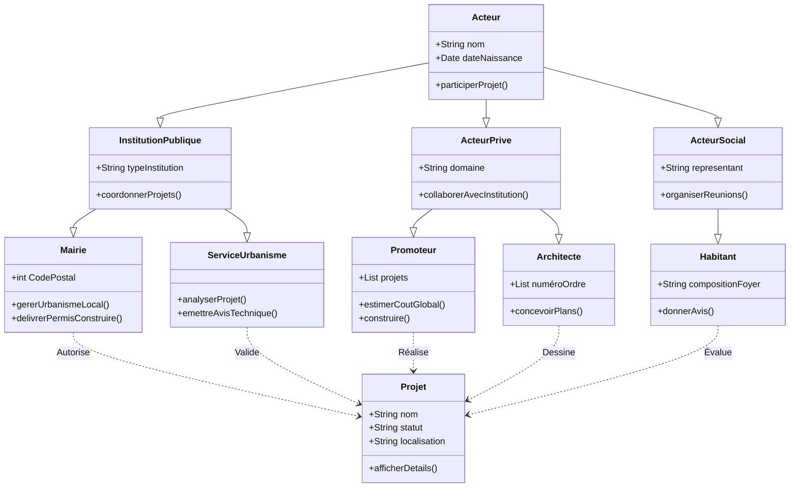

```mermaid
classDiagram
    direction TB

    class Acteur {
        +String nom
        +Date dateNaissance
        +participerProjet()
    }

    class InstitutionPublique {
        +String typeInstitution
        +coordonnerProjets()
    }

    class ActeurPrive {
        +String domaine
        +collaborerAvecInstitution()
    }

    class ActeurSocial {
        +String representant
        +organiserReunions()
    }

    class Mairie {
        +int CodePostal
        +gererUrbanismeLocal()
        +delivrerPermisConstruire()
    }

    class ServiceUrbanisme {
        +analyserProjet()
        +emettreAvisTechnique()
    }

    class Promoteur {
        +List projets
        +estimerCoutGlobal()
        +construire()
    }

    class Architecte {
        +List numéroOrdre
        +concevoirPlans()
    }

    class Habitant {
        +String compositionFoyer
        +donnerAvis()
    }

    class Projet {
        +String nom
        +String statut
        +String localisation
        +afficherDetails()
    }

    %% Hiérarchie (Flèches vers le bas)
    Acteur --|> InstitutionPublique
    Acteur --|> ActeurPrive
    Acteur --|> ActeurSocial

    InstitutionPublique --|> Mairie
    InstitutionPublique --|> ServiceUrbanisme

    ActeurPrive --|> Promoteur
    ActeurPrive --|> Architecte

    ActeurSocial --|> Habitant

    %% Action vers le Projet (Tout en bas)
    Mairie ..> Projet : Autorise
    ServiceUrbanisme ..> Projet : Valide
    Promoteur ..> Projet : Réalise
    Architecte ..> Projet : Dessine
    Habitant ..> Projet : Évalue
```
