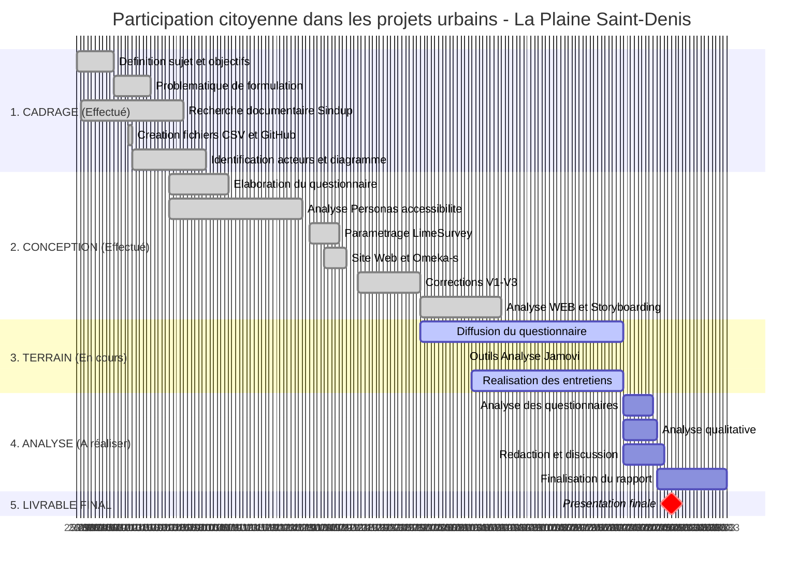

```mermaid
gantt
    title Participation citoyenne dans les projets urbains - La Plaine Saint-Denis
   dateFormat  YYYY-MM-DD
    axisFormat  %d/%m
    tickInterval 1day

    section 1. CADRAGE (Effectué)
    Definition sujet et objectifs           :done, t1, 2025-09-25, 2025-10-05
    Problematique de formulation            :done, t2, 2025-10-05, 2025-10-15
    Recherche documentaire Sindup           :done, t3, 2025-09-26, 2025-10-24
    Creation fichiers CSV et GitHub         :done, t4, 2025-10-09, 2025-10-10
    Identification acteurs et diagramme     :done, t5, 2025-10-10, 2025-10-30

    section 2. CONCEPTION (Effectué)
    Elaboration du questionnaire            :done, t6, 2025-10-20, 2025-11-05
    Analyse Personas accessibilite          :done, t7, 2025-10-20, 2025-11-25
    Parametrage LimeSurvey                  :done, t8, 2025-11-27, 2025-12-05
    Site Web et Omeka-s                     :done, t9, 2025-12-01, 2025-12-07
    Corrections V1-V3                       :done, t10, 2025-12-10, 2025-12-27
    Analyse WEB et Storyboarding            :done, t11, 2025-12-27, 2026-01-18

    section 3. TERRAIN (En cours)
    Diffusion du questionnaire              :active, t12, 2025-12-27, 2026-02-20
    Outils Analyse Jamovi                   :done, t13, 2026-01-08, 0d
    Realisation des entretiens              :active, t14, 2026-01-10, 2026-02-20

    section 4. ANALYSE (A réaliser)
    Analyse des questionnaires              :t15, 2026-02-20, 2026-02-28
    Analyse qualitative                     :t16, 2026-02-20, 2026-03-01
    Redaction et discussion                 :t17, 2026-02-20, 2026-03-03
    Finalisation du rapport                 :t18, 2026-03-01, 2026-03-20

    section 5. LIVRABLE FINAL
    Presentation finale                     :crit, milestone, 2026-03-05, 0d
```
