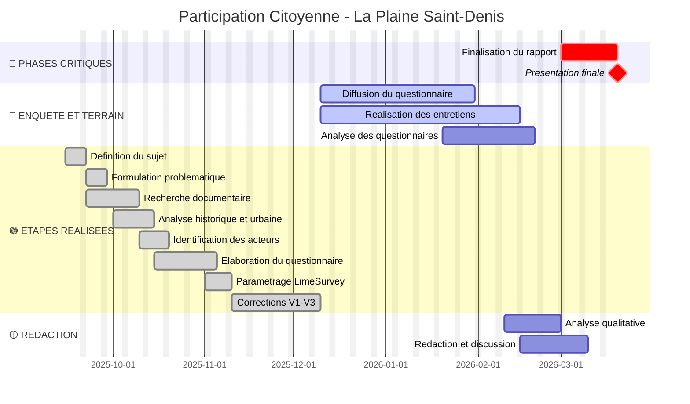

```mermaid
gantt
    dateFormat  YYYY-MM-DD
    title Participation Citoyenne - La Plaine Saint-Denis
    excludes weekends

    section 🔴 PHASES CRITIQUES
    Finalisation du rapport          :crit, t19, 2026-03-01, 2026-03-20
    Presentation finale              :crit, milestone, 2026-03-20, 0d

    section 🔵 ENQUETE ET TERRAIN
    Diffusion du questionnaire       :active, t12, 2025-12-10, 2026-01-31
    Realisation des entretiens       :active, t15, 2025-12-10, 2026-02-15
    Analyse des questionnaires       :t16, 2026-01-20, 2026-02-20

    section 🟢 ETAPES REALISEES
    Definition du sujet              :done, t1, 2025-09-15, 2025-09-22
    Formulation problematique        :done, t2, 2025-09-22, 2025-09-29
    Recherche documentaire           :done, t3, 2025-09-22, 2025-10-10
    Analyse historique et urbaine    :done, t5, 2025-10-01, 2025-10-15
    Identification des acteurs       :done, t6, 2025-10-10, 2025-10-20
    Elaboration du questionnaire     :done, t7, 2025-10-15, 2025-11-05
    Parametrage LimeSurvey           :done, t8, 2025-11-01, 2025-11-10
    Corrections V1-V3                :done, t9, 2025-11-10, 2025-12-10

    section 🟡 REDACTION
    Analyse qualitative              :t17, 2026-02-10, 2026-03-01
    Redaction et discussion          :t18, 2026-02-15, 2026-03-10
```
