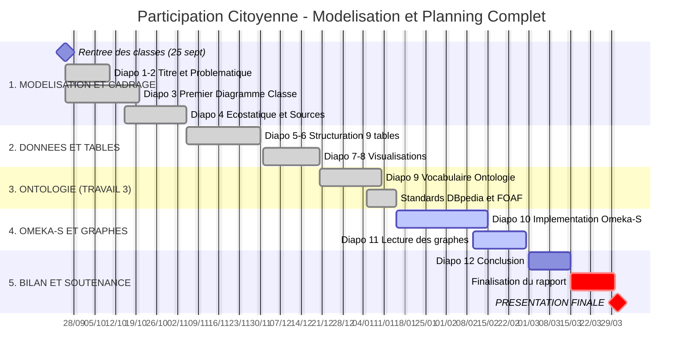

```mermaid
gantt
    dateFormat  YYYY-MM-DD
    title Participation Citoyenne - Modelisation et Planning Complet
    axisFormat  %d/%m
    tickInterval 1week
    excludes    weekends

    section 1. MODELISATION ET CADRAGE
    Rentree des classes (25 sept)    :milestone, m1, 2025-09-25, 0d
    Diapo 1-2 Titre et Problematique :done, t1, 2025-09-25, 2025-10-10
    Diapo 3 Premier Diagramme Classe :done, t2, 2025-09-25, 2025-10-20
    Diapo 4 Ecostatique et Sources   :done, t3, 2025-10-15, 2025-11-05

    section 2. DONNEES ET TABLES
    Diapo 5-6 Structuration 9 tables :done, t4, 2025-11-05, 2025-11-30
    Diapo 7-8 Visualisations         :done, t5, 2025-12-01, 2025-12-20

    section 3. ONTOLOGIE (TRAVAIL 3)
    Diapo 9 Vocabulaire Ontologie    :done, t6, 2025-12-20, 2026-01-10
    Standards DBpedia et FOAF        :done, t7, 2026-01-05, 2026-01-15

    section 4. OMEKA-S ET GRAPHES
    Diapo 10 Implementation Omeka-S  :active, t8, 2026-01-15, 2026-02-15
    Diapo 11 Lecture des graphes     :active, t9, 2026-02-10, 2026-02-28

    section 5. BILAN ET SOUTENANCE
    Diapo 12 Conclusion              :t10, 2026-03-01, 2026-03-15
    Finalisation du rapport          :crit, t11, 2026-03-15, 2026-03-30
    PRESENTATION FINALE              :crit, milestone, 2026-03-31, 0d


```
