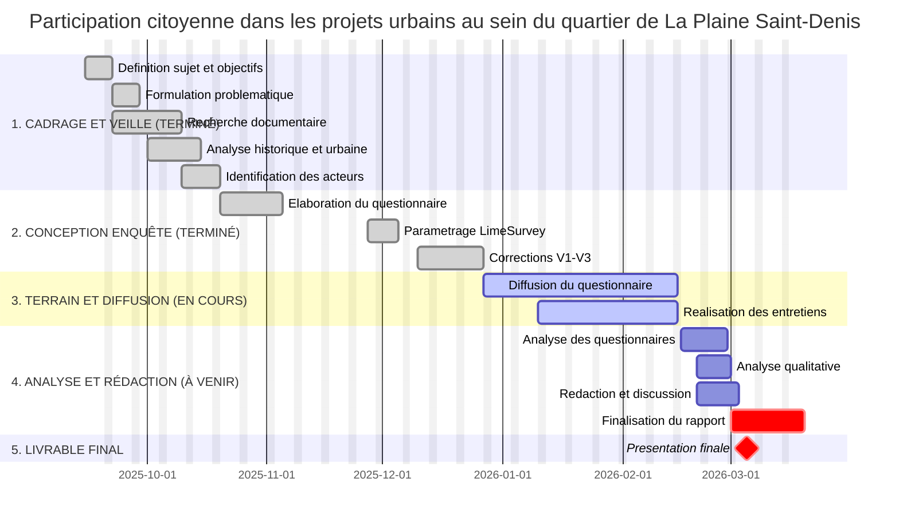

```mermaid
gantt
    dateFormat  YYYY-MM-DD
    title Participation citoyenne dans les projets urbains au sein du quartier de La Plaine Saint-Denis
    excludes weekends

    section 1. CADRAGE ET VEILLE (TERMINÉ)
    Definition sujet et objectifs    :done, t1, 2025-09-15, 2025-09-22
    Formulation problematique        :done, t2, 2025-09-22, 2025-09-29
    Recherche documentaire           :done, t3, 2025-09-22, 2025-10-10
    Analyse historique et urbaine    :done, t5, 2025-10-01, 2025-10-15
    Identification des acteurs       :done, t6, 2025-10-10, 2025-10-20

    section 2. CONCEPTION ENQUÊTE (TERMINÉ)
    Elaboration du questionnaire     :done, t7, 2025-10-20, 2025-11-05
    Parametrage LimeSurvey           :done, t8, 2025-11-27, 2025-12-05
    Corrections V1-V3                :done, t9, 2025-12-10, 2025-12-27

    section 3. TERRAIN ET DIFFUSION (EN COURS)
    Diffusion du questionnaire       :active, t12, 2025-12-27, 2026-02-15
    Realisation des entretiens       :active, t15, 2026-01-10, 2026-02-15

    section 4. ANALYSE ET RÉDACTION (À VENIR)
    Analyse des questionnaires       :t16, 2026-02-16, 2026-02-28
    Analyse qualitative              :t17, 2026-02-20, 2026-03-01
    Redaction et discussion          :t18, 2026-02-20, 2026-03-03
    Finalisation du rapport          :crit, t19, 2026-03-01, 2026-03-20

    section 5. LIVRABLE FINAL
    Presentation finale              :crit, milestone, 2026-03-05, 0d
```
