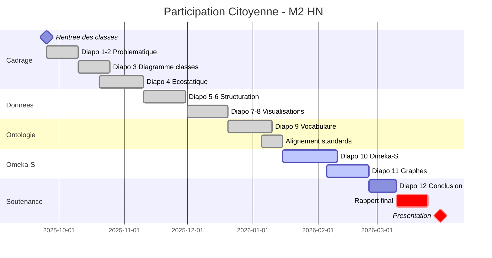

```mermaid
gantt
    dateFormat  YYYY-MM-DD
    title Participation Citoyenne - M2 HN
    
    section Cadrage
    Rentree des classes         :milestone, m1, 2025-09-25, 0d
    Diapo 1-2 Problematique     :done, t1, 2025-09-25, 2025-10-10
    Diapo 3 Diagramme classes   :done, t2, 2025-10-10, 2025-10-25
    Diapo 4 Ecostatique         :done, t3, 2025-10-20, 2025-11-10

    section Donnees
    Diapo 5-6 Structuration     :done, t4, 2025-11-10, 2025-11-30
    Diapo 7-8 Visualisations    :done, t5, 2025-12-01, 2025-12-20

    section Ontologie
    Diapo 9 Vocabulaire         :done, t6, 2025-12-20, 2026-01-10
    Alignement standards        :done, t7, 2026-01-05, 2026-01-15

    section Omeka-S
    Diapo 10 Omeka-S            :active, t8, 2026-01-15, 2026-02-10
    Diapo 11 Graphes            :active, t9, 2026-02-05, 2026-02-25

    section Soutenance
    Diapo 12 Conclusion         :t10, 2026-02-25, 2026-03-10
    Rapport final               :crit, t11, 2026-03-10, 2026-03-25
    Presentation                :crit, milestone, 2026-03-31, 0d


```
