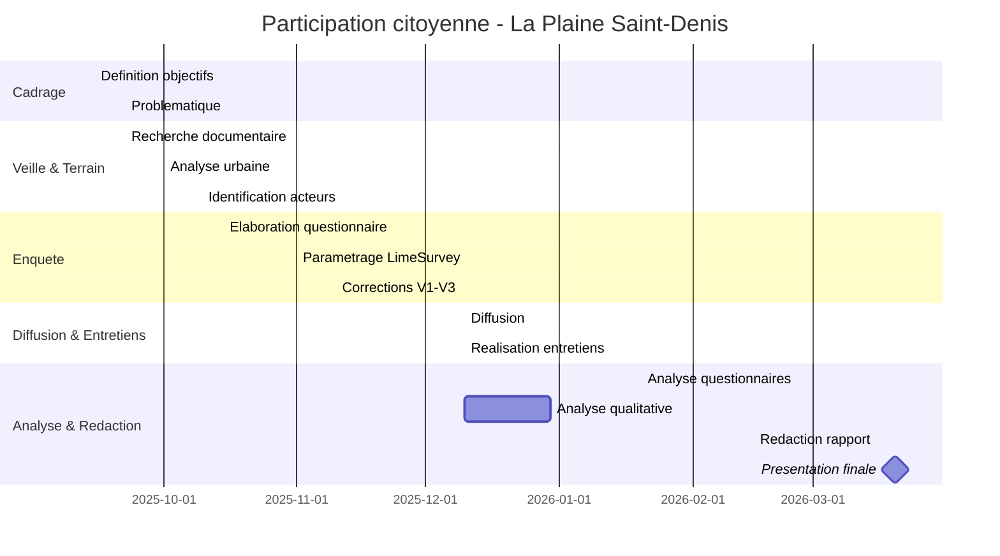

```mermaid
gantt
    dateFormat  2026-01-29
    title Participation citoyenne - La Plaine Saint-Denis
    

    section Cadrage
    Definition objectifs           :done, t1, 2025-09-15, 2025-09-22
    Problematique                  :done, t2, 2025-09-22, 2025-09-29

    section Veille & Terrain
    Recherche documentaire         :done, t3, 2025-09-22, 2025-10-10
    Analyse urbaine                :done, t5, 2025-10-01, 2025-10-15
    Identification acteurs         :done, t6, 2025-10-10, 2025-10-20

    section Enquete
    Elaboration questionnaire      :done, t7, 2025-10-15, 2025-11-05
    Parametrage LimeSurvey         :done, t8, 2025-11-01, 2025-11-10
    Corrections V1-V3              :done, t9, 2025-11-10, 2025-12-10

    section Diffusion & Entretiens
    Diffusion                      :active, t12, 2025-12-10, 2026-01-31
    Realisation entretiens         :active, t15, 2025-12-10, 2026-02-15

    section Analyse & Redaction
    Analyse questionnaires         :t16, 2026-01-20, 2026-02-20
    Analyse qualitative            :t17, after t15, 20d
    Redaction rapport              :t18, 2026-02-15, 2026-03-10
    Presentation finale            :milestone, t20, 2026-03-20, 0d
```
