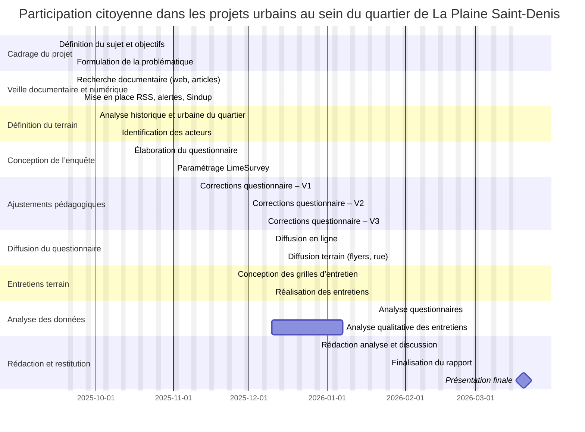

```mermaid
gantt
    dateFormat  2026-01-29
    title      Participation citoyenne dans les projets urbains au sein du quartier de La Plaine Saint-Denis
    excludes    weekends
    %% (`excludes` accepts specific dates in YYYY-MM-DD format, days of the week ("sunday") or "weekends", but not the word "weekdays".)

   section Cadrage du projet
    Définition du sujet et objectifs          :done,    t1, 2025-09-15, 2025-09-22
    Formulation de la problématique           :done,    t2, 2025-09-22, 2025-09-29

    section Veille documentaire et numérique
    Recherche documentaire (web, articles)   :done,    t3, 2025-09-22, 2025-10-10
    Mise en place RSS, alertes, Sindup        :done,    t4, 2025-09-25, 2025-10-15

    section Définition du terrain
    Analyse historique et urbaine du quartier:done,    t5, 2025-10-01, 2025-10-15
    Identification des acteurs                :done,    t6, 2025-10-10, 2025-10-20


    section Conception de l’enquête
    Élaboration du questionnaire              :done,    t7, 2025-10-15, 2025-11-05
    Paramétrage LimeSurvey                    :done,    t8, 2025-11-01, 2025-11-10


    section Ajustements pédagogiques
    Corrections questionnaire – V1            :done,    t9, 2025-11-10, 2025-11-25
    Corrections questionnaire – V2            :done,    t10, 2025-12-01, 2025-12-07
    Corrections questionnaire – V3            :done,    t11, 2025-12-07, 2025-12-10

    section Diffusion du questionnaire
    Diffusion en ligne                        :active,  t12, 2025-12-10, 2026-01-31
    Diffusion terrain (flyers, rue)           :active,  t13, 2025-12-15, 2026-01-31

    section Entretiens terrain
    Conception des grilles d’entretien        :done,    t14, 2025-11-25, 2025-12-05
    Réalisation des entretiens                :active,  t15, 2025-12-10, 2026-02-15


    section Analyse des données
    Analyse questionnaires                   :         t16, 2026-01-20, 2026-02-20
    Analyse qualitative des entretiens        :         t17, after t15, 20d


    section Rédaction et restitution
    Rédaction analyse et discussion           :         t18, 2026-02-15, 2026-03-10
    Finalisation du rapport                   :         t19, 2026-03-01, 2026-03-20
    Présentation finale                      :milestone, t20, 2026-03-20, 0d

```
